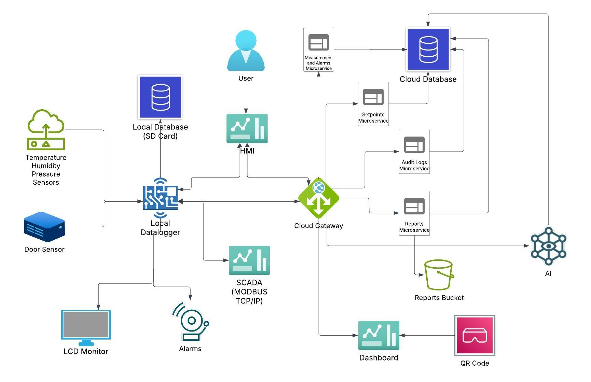
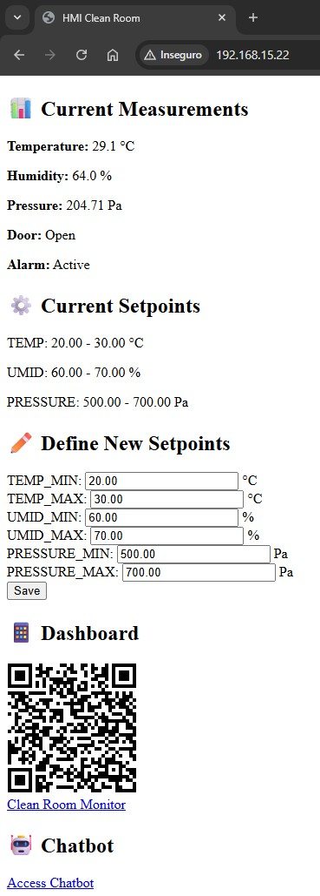
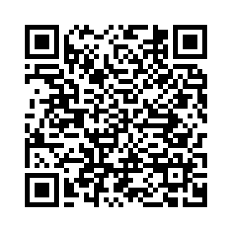
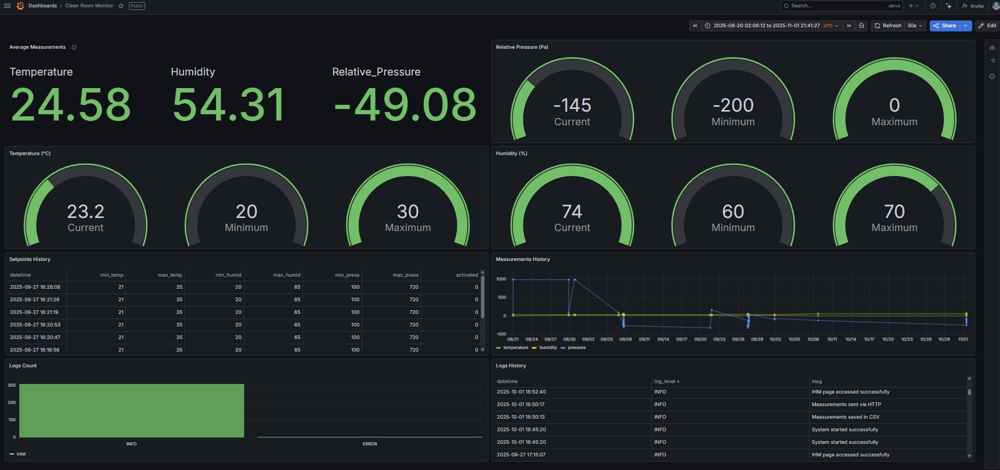
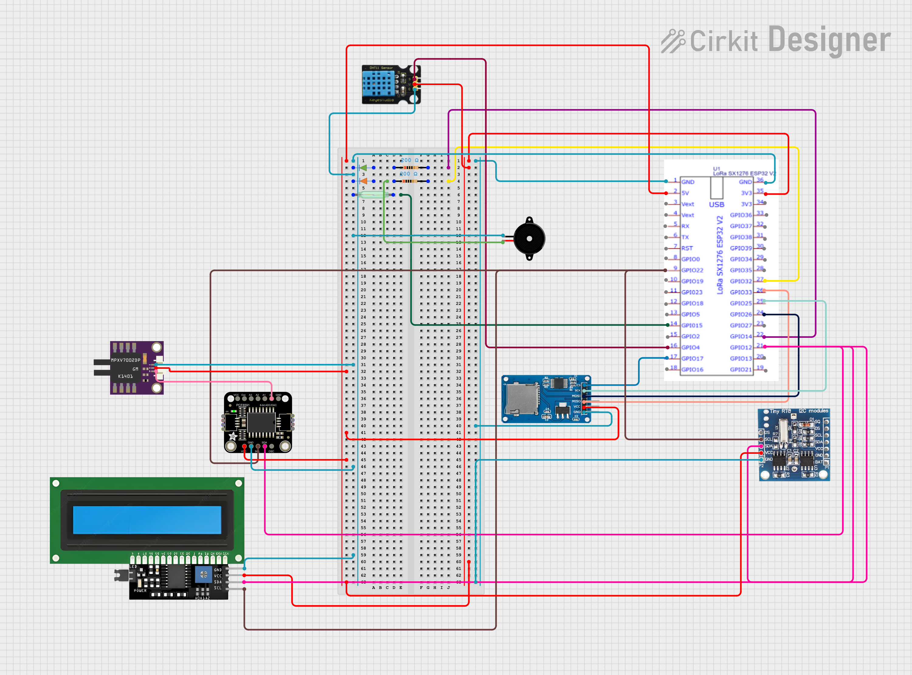
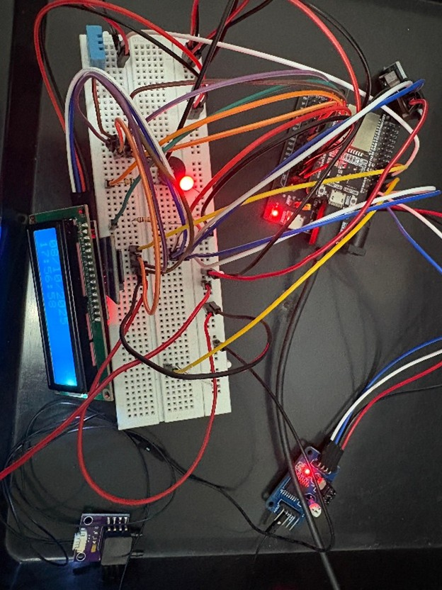

# ESP32 Data Logger for Pharmaceutical Clean Rooms

This repository provides the implementation of a **data acquisition, availability, and monitoring system via IoT for controlled environments in the pharmaceutical industry**. It accompanies a manuscript submitted in the style of IEEE Transactions and describes a low-cost ESP32-based data logger with local storage, alarms, cloud integration, and SCADA connectivity via Modbus TCP/IP.

The system is designed for continuous monitoring of environmental parameters in clean rooms, with local CSV logging, an embedded web-based HMI, HTTP forwarding to a cloud backend, and optional integration with BI dashboards (e.g., Grafana) and supervisory systems.

---

## 1. System overview

The system continuously monitors the following variables in clean rooms:

- **Temperature** (e.g., DHT11)
- **Relative humidity** (DHT11)
- **Differential pressure** (MPXV7002DP with PCF8591 ADC)
- **Door status** (open/closed via reed switch)

Main capabilities:

- ESP32-based data logger with SD-card logging in CSV format and RTC timestamps
- Local 16×2 LCD display and audible/visual alarms (buzzer and LEDs)
- Embedded HTTP server providing a virtual HMI
- HTTP client to send JSON measurements to a cloud API
- Modbus TCP/IP server interface for SCADA integration
- QR code linking to the Grafana (or BI) dashboard
- Python utilities for report generation, QR generation, Modbus testing, and data persistence (logs, measurements, setpoints) hosted in the cloud.

---

## 2. Architecture

### 2.1 High-level architecture

The figure below summarizes the logical architecture: the ESP32 data logger acquires sensor data, stores it locally on SD, exposes a virtual HMI over HTTP, acts as a Modbus TCP/IP server for SCADA, and forwards measurements to the cloud over HTTPS.



### 2.2 RAMI 4.0 mapping

The implementation is aligned with RAMI 4.0 layers as discussed in the manuscript. The asset layer comprises the sensors and the ESP32 device; integration and communication are realized via Modbus TCP/IP and HTTP; information and function layers cover validation rules, alarms, and cloud storage; the business layer is represented by SCADA and BI dashboards.


---

## 3. Repository structure

```text
DataLoggerLocal/
├── docs/
│   ├── system_logical_architecture.png   # High-level system diagram (from article)
│   ├── rami_layers_implementation.png    # RAMI 4.0 mapping (from article)
│   ├── local_datalogger_prototype.jpg     # Prototype photograph
│   ├── virtual_hmi_implementation.png     # Web-based HMI screenshot
│   ├── bi_dashboard_grafana.png           # BI/Grafana dashboard
│   └── system_electrical_diagram.png      # Fritzing wiring diagram
├── esp32_datalogger_firmware.ino         # ESP32 firmware (Arduino)
├── generate_qrcode.py                    # Generates QR code for Grafana/BI dashboard
├── modbus_client.py                      # Modbus TCP client for testing SCADA integration
├── generate_reports.py                   # Exports RDS data to CSV and uploads to S3 (Lambda-style)
├── save_logs.py                          # Persists log entries to RDS (Lambda-style)
├── save_measurements.py                  # Persists measurements to RDS (Lambda-style)
├── save_setpoints.py                     # Persists/updates alarm setpoints in RDS (Lambda-style)
├── grafana_dashboard_qr.png             # Example QR code image (output of generate_qrcode.py)
└── README.md                             # This file
```

---

## 4. ESP32 firmware

### 4.1 Features

The firmware in `esp32_datalogger_firmware.ino` provides:

- Reading of temperature and relative humidity (DHT11), differential pressure (MPXV7002DP via PCF8591), and door status (reed switch)
- Validation and alarm thresholds (configurable setpoints)
- Local storage of measurements on SD card in CSV format with RTC (DS1307) timestamps
- Current values and alarm status on a 16×2 I2C LCD
- Virtual HMI via embedded HTTP server (port 80)
- HTTP/HTTPS client to send JSON payloads to a cloud API gateway
- Modbus TCP server (port 502) exposing holding registers for sensors and setpoints
- Buzzer and LEDs for audible/visual alarm indication

The embedded web server provides a virtual HMI at the device’s local IP (e.g. `http://192.168.15.22`), where operators can view current measurements and setpoints, define new alarm limits, and access the dashboard via QR code or link.



### 4.2 Configuration (example)

Network, API, and Modbus settings may be centralized in a header. Example:

```cpp


#define WIFI_SSID        "REPLACE_WITH_YOUR_SSID"
#define WIFI_PASSWORD    "REPLACE_WITH_YOUR_PASSWORD"

#define API_BASE_URL     "https://YOUR_API_GATEWAY_URL"
#define API_AUTH_TOKEN   "REPLACE_WITH_YOUR_TOKEN"

#define MODBUS_SERVER_IP   "REPLACE_WITH_YOUR_LOCAL_SERVER_IP"
#define MODBUS_SERVER_PORT 502
```

### Typical workflow (Arduino IDE or PlatformIO)

```bash
# 1. Open esp32_datalogger_firmware.ino
# 2. Configure Wi-Fi, API URL/token, and pin mapping (or include config.h)
# 3. Compile
# 4. Upload to ESP32
# 5. Open Serial Monitor to verify connectivity and sensor readings
```

---

## 5. Python utilities

### 5.1 Dashboard QR-code generator

`generate_qrcode.py` generates a QR code that points to the Grafana (or BI) dashboard URL, so operators can open the dashboard quickly from a mobile device. Edit the script to set the dashboard URL, then run it to produce `grafana_dashboard_qr.png`.

```bash
python generate_qrcode.py
```

The output file is `grafana_dashboard_qr.png` in the current directory.



Scanning the QR code (or opening the dashboard URL) leads to the Clean Room Monitor BI dashboard, which displays average and current readings (temperature, humidity, pressure), gauges with setpoints, measurements history, setpoints history, and log tables.



### 5.2 Modbus client test

`modbus_client.py` is a Modbus TCP client used to test the ESP32 Modbus server: it reads holding registers for temperature, humidity, pressure, door state, and alarm state, and can write setpoint registers. Set `MODBUS_IP` and `MODBUS_PORT` at the top of the script to match the ESP32, then run:

```bash
python modbus_client.py
```

Example for a different host/port (after editing the script variables): `MODBUS_IP = '192.168.0.50'`, `MODBUS_PORT = 502`.

### 5.3 Report generation

`generate_reports.py` is intended for use in a serverless or scripted pipeline. It connects to RDS, queries a given table (e.g., `logs_table`, `measurements_table`, `setpoints_table`) with optional date range, exports the result to CSV, and uploads it to S3. It expects environment variables such as `RDS_HOST`, `RDS_USER`, `RDS_PASS`, `RDS_DB`, `RDS_PORT`, and `BUCKET_NAME` (e.g., in Lambda or a local `.env`).

```bash
# Example: run in an environment where RDS_* and BUCKET_NAME are set;
# event payload would provide table_name, start_date, end_date
python -c "from generate_reports import lambda_handler; print(lambda_handler({'table_name':'measurements_table','start_date':'2025-01-01','end_date':'2025-01-31'}, None))"
```

### 5.4 Data persistence helpers

The following scripts are designed as Lambda handlers (or similar) for persisting data to an RDS database. They rely on environment variables for RDS connection (`RDS_HOST`, `RDS_USER`, `RDS_PASS`, `RDS_DB`, `RDS_PORT`).

- **save_logs.py** — Inserts log entries (datetime, log_level, message) into `logs_table`.
- **save_measurements.py** — Inserts sensor measurements (datetime, temperature, humidity, pressure, door_state, alarm_state) into `measurements_table`.
- **save_setpoints.py** — Updates alarm setpoints in `setpoints_table` (deactivates previous setpoints and inserts the new active set).

No long command-line examples are given here; they are typically invoked by a cloud backend (e.g., API Gateway plus Lambda) with event payloads containing the corresponding fields.

---

## 6. Hardware and prototype

Main components of the local data logger prototype:

- **Controller**: ESP32
- **Sensors**: DHT11 (temperature and humidity), MPXV7002DP with PCF8591 (differential pressure), reed switch (door status)
- **Display**: 16×2 I2C LCD
- **Storage**: SD card (SPI)
- **RTC**: DS1307 for timestamps
- **Alarms**: Buzzer and LEDs (e.g., green and red)

The electrical diagram below shows the connections between the ESP32 and the sensors and peripherals (DHT11, MPXV7002DP, PCF8591, LCD, SD card, RTC DS1307, buzzer, LEDs, reed switch).





The photograph above shows the assembled prototype with the ESP32, LCD, and peripheral connections used in the experiments described in the manuscript.

---

## 7. Relation to the article and reproducibility

This repository provides the implementation artifacts (firmware and Python utilities) that support the manuscript. It is intended to facilitate technology transfer and reproducibility of the data acquisition and monitoring system for pharmaceutical clean rooms.

**Citation (template):**

> L. E. S. Moraes and R. Squillante Jr., “Data Acquisition, Availability, and Monitoring System via IoT for Controlled Environments in the Pharmaceutical Industry.” Submission to: IEEE Latin America Transactions. Submission date: DD Month YYYY.
